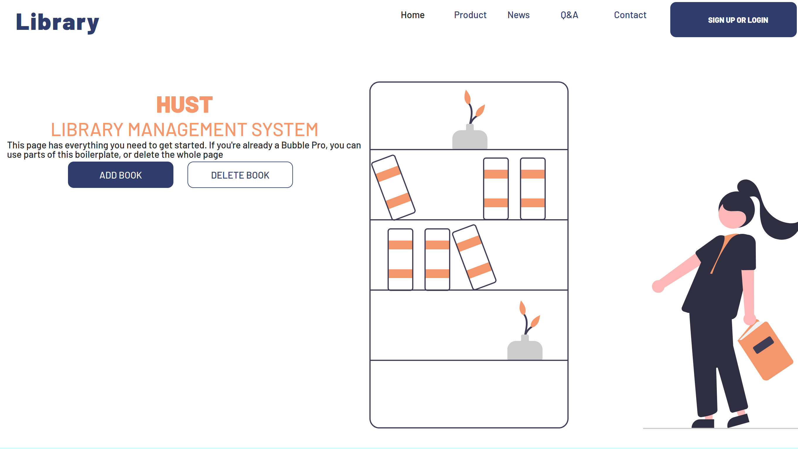
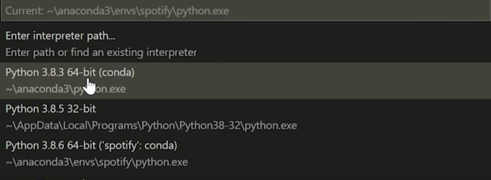

# Hust-library
## THIS IS THE MINI PROJECT TO DEVELOP THE LIBRARY WEBSITE FOR HUST STUDENT AND STAFF 

###### PART 1: TO RUN THIS PROGRAM, IT REQUIRES TO INSTALL SOME RELEVANT PACKAGES.
1. INSTALLING FLASK:
    ```
    source env/bin/activate
    pip install flask
    pip install flask-login
    pip install flask-sqlalchemy
    ```
2. SET INTERPRETER:
    - Hit control, shift and P on keyboard: vscode command pallet
    - Type python and select interpreter
        
3. RUN APP: 
    ```
    python3 main.py
    ```


